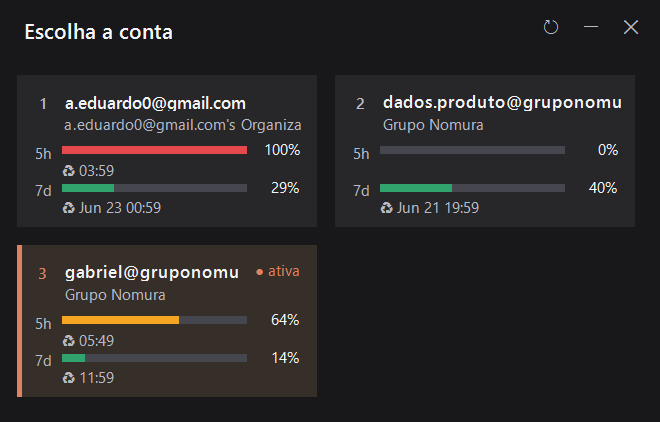

# Claude Switch GUI

Interface gráfica (Windows) para trocar de conta do **Claude Code** com um clique.
É uma casca visual em cima da CLI [`claude-swap`](https://pypi.org/project/claude-swap/)
(comando `cswap`): ao abrir, lê `cswap --list` e mostra cada conta como um card com
uso de 5h/7d. Clicar no card troca a conta ativa (`cswap --switch-to N`).



## Funcionalidades

- **Cards lado a lado** (grid de 2 colunas que quebra linha conforme o nº de contas).
- **Barras de uso 5h e 7d** coloridas: verde (folga) → amarelo (≥60%) → vermelho (≥85%).
- **Horário de reset** de cada limite (com símbolo ♻ monocromático).
- **Card inteiro clicável** — clica em qualquer lugar do card pra trocar pra aquela conta.
- **Conta ativa** destacada com faixa lateral terracota + selo "● ativa" (não clicável).
- **Sem barra de título** — janela própria com botões de refresh, minimizar e fechar
  (ícones vetoriais do Segoe MDL2 Assets), arrastável pelo cabeçalho.
- **DPI-aware**: texto nítido em telas com escala (125%, 150%, etc.).
- **Tooltip** com email + organização completos ao passar o mouse (cards recortam textos longos).
- **Toast de confirmação** após a troca, com o ícone do app, mostrando a conta e o uso atual.
- Atalhos de teclado: **1–9** trocam pela conta correspondente, **Esc** fecha.

## Requisitos

| Requisito | Detalhe |
|-----------|---------|
| **Windows** | 10/11 (usa WinForms + fontes `Segoe MDL2 Assets` / `Segoe UI Symbol`). |
| **`cswap` no PATH** | A CLI `claude-swap`. Instale com [uv](https://docs.astral.sh/uv/): `uv tool install claude-swap`. O app chama `cswap --list` e `cswap --switch-to`. |
| **PowerShell** | Windows PowerShell 5.1 (já vem no Windows) ou PowerShell 7. |
| **Módulo `ps2exe`** | Só para **recompilar** o `.exe`. Instale com `Install-Module ps2exe`. |
| **Python + Pillow** | Só para **regenerar o ícone** via `make_icon.py` (opcional). `pip install pillow`. |

> Para **apenas usar** o app, basta o Windows + `cswap` instalado. O `ps2exe` e o
> Python só são necessários para rebuildar o executável ou o ícone.

## Como usar

Dê duplo-clique em **`Claude Switch.exe`** (ou em `Claude Switch.bat`, que apenas
dispara o `.ps1` com a janela oculta do PowerShell).

## Estrutura dos arquivos

| Arquivo | Papel |
|---------|-------|
| `claude-switch.ps1` | **Código-fonte** da janela (WinForms em PowerShell). |
| `Claude Switch.exe` | Executável compilado a partir do `.ps1` (artefato de build). |
| `Claude Switch.bat` | Launcher alternativo (roda o `.ps1` sem console). |
| `claude-switch-full.ico` | Ícone do app (usado no `.exe`, na janela e no toast). |
| `make_icon.py` | Gerador do ícone (desenha o `.ico` do zero com Pillow). |

## Como recompilar o `.exe`

Toda mudança de comportamento/visual é feita no **`claude-switch.ps1`**. Depois,
recompile pra gerar o `.exe`:

```powershell
# uma vez, se ainda não tiver o módulo:
Install-Module ps2exe -Scope CurrentUser

# na pasta do projeto:
Import-Module ps2exe
Invoke-ps2exe `
  -inputFile  ".\claude-switch.ps1" `
  -outputFile ".\Claude Switch.exe" `
  -iconFile   ".\claude-switch-full.ico" `
  -noConsole `
  -title      "Claude Switch" `
  -description "Multi-account switcher for Claude Code"
```

- `-noConsole` — sem janela de console (é um app de janela).
- `-iconFile` — embute o ícone no `.exe`.

### Dica de debug

Para ver erros do `.ps1` sem compilar (o `.exe` não mostra stderr), rode direto e
capture o erro:

```powershell
powershell -ExecutionPolicy Bypass -NoProfile -File ".\claude-switch.ps1"
```

## Como regenerar o ícone (opcional)

```powershell
pip install pillow
python .\make_icon.py
```

Gera/atualiza `claude-switch-full.ico`. Recompile o `.exe` em seguida para embutir o
novo ícone.

## Notas de implementação

- **Escala DPI manual**: o `.ps1` declara DPI-awareness no início e escala todas as
  medidas por um fator (`Px`/`Pt`/`Sz`/`Fnt`), com `AutoScaleMode = None`. Fontes são
  em pixels escalados — daí o texto nítido em qualquer escala de tela.
- **Aliases do PowerShell**: helpers de escala usam nomes como `Px`/`Pxf` de propósito
  — `Sc` colide com o alias nativo `Set-Content` (aliases têm prioridade sobre funções).
- **Texto longo**: labels de email/org **não** usam `AutoEllipsis` (ele apaga strings
  longas sem espaço, como emails, no WinForms); o texto é recortado e o completo fica
  no tooltip.
