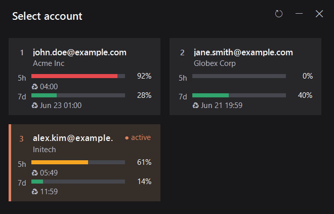

# Claude Switch GUI

A Windows GUI to switch **Claude Code** accounts with a single click.
It is a visual shell on top of the [`claude-swap`](https://pypi.org/project/claude-swap/)
CLI (the `cswap` command): on launch it reads `cswap --list` and shows each account
as a card with 5h/7d usage. Clicking a card switches the active account
(`cswap --switch-to N`).



## Features

- **Cards side by side** (a 2-column grid that wraps based on the number of accounts).
- **5h and 7d usage bars**, color-coded: green (plenty) → amber (≥60%) → red (≥85%).
- **Reset time** for each limit (with a monochrome ♻ glyph).
- **Whole card is clickable** — click anywhere on a card to switch to that account.
- **Active account** highlighted with a terracotta left stripe + "● active" badge (not clickable).
- **No title bar** — custom window with refresh / minimize / close buttons
  (crisp vector icons from Segoe MDL2 Assets); drag it by the header.
- **DPI-aware**: crisp text on scaled displays (125%, 150%, etc.).
- **Tooltip** with the full email + organization on hover (cards clip long text).
- **Confirmation toast** after a switch, with the app icon, showing the account and current usage.
- Keyboard shortcuts: **1–9** switch to the matching account, **Esc** closes.

## Requirements

| Requirement | Detail |
|-------------|--------|
| **Windows** | 10/11 (uses WinForms + the `Segoe MDL2 Assets` / `Segoe UI Symbol` fonts). |
| **`cswap` on PATH** | The `claude-swap` CLI. Install with [uv](https://docs.astral.sh/uv/): `uv tool install claude-swap`. The app calls `cswap --list` and `cswap --switch-to`. |
| **PowerShell** | Windows PowerShell 5.1 (ships with Windows) or PowerShell 7. |
| **`ps2exe` module** | Only to **recompile** the `.exe`. Install with `Install-Module ps2exe`. |

> To just **use** the app you only need Windows + `cswap` installed. `ps2exe` is
> only required to rebuild the executable.

## Usage

Double-click **`Claude Switch.bat`** — it runs the `.ps1` with a hidden PowerShell
window and works straight from a clone (no build step). Or build/download
**`Claude Switch.exe`** (see *Recompiling* below) for a single-file double-click
launcher with the embedded icon.

## Files

| File | Role |
|------|------|
| `claude-switch.ps1` | **Source code** of the window (WinForms in PowerShell). |
| `build.ps1` | Build script: compiles the `.ps1` to `Claude Switch.exe` via ps2exe. |
| `Claude Switch.exe` | Executable compiled from the `.ps1`. **Build artifact — not tracked in git**; build it with `build.ps1` or grab it from a Release. |
| `Claude Switch.bat` | Alternative launcher (runs the `.ps1` with no console). |
| `claude-switch-full.ico` | App icon (used by the `.exe` and the window). |
| `claude-switch-full.png` | Same icon as PNG, used by the modern toast (WinRT toasts don't render `.ico` reliably). |

## Recompiling the `.exe`

All behavior/visual changes are made in **`claude-switch.ps1`**. Then build the
`.exe` with the build script:

```powershell
# once, if you don't have the module yet:
Install-Module ps2exe -Scope CurrentUser

# in the project folder:
./build.ps1            # compile claude-switch.ps1 -> "Claude Switch.exe"
```

`build.ps1` wraps the exact `ps2exe` invocation (`-noConsole` so there's no console
window, `-iconFile` to embed the icon), so the build is one reproducible command.

> The `.exe` is **not committed** — it's a build artifact. Build it locally, or
> publish it on a tagged GitHub Release (ideally signed, with a published SHA-256)
> so users can verify it matches the source.

### Debugging tip

To see `.ps1` errors without compiling (the `.exe` does not surface stderr), run it
directly and capture the error:

```powershell
powershell -ExecutionPolicy Bypass -NoProfile -File ".\claude-switch.ps1"
```

## Implementation notes

- **Manual DPI scaling**: the `.ps1` declares DPI awareness up front and scales every
  measurement by a factor (`Px`/`Pt`/`Sz`/`Fnt`), with `AutoScaleMode = None`. Fonts are
  in scaled pixels — that's what keeps text crisp at any display scale.
- **PowerShell aliases**: the scaling helpers are named `Px`/`Pxf` on purpose — `Sc`
  collides with the built-in `Set-Content` alias (aliases take precedence over functions).
- **Long text**: the email/org labels do **not** use `AutoEllipsis` (it blanks long
  space-less strings like emails in WinForms); the text is clipped and the full value
  lives in the tooltip.
